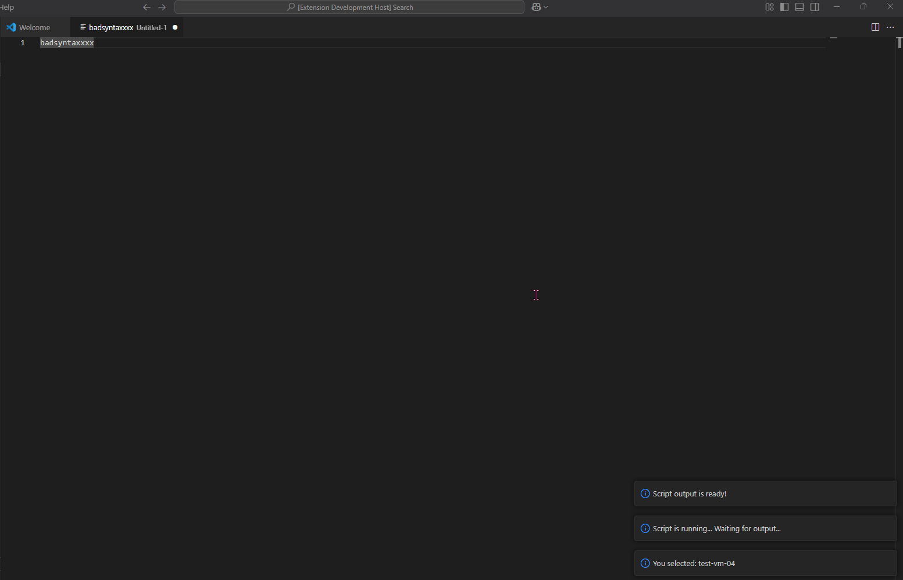
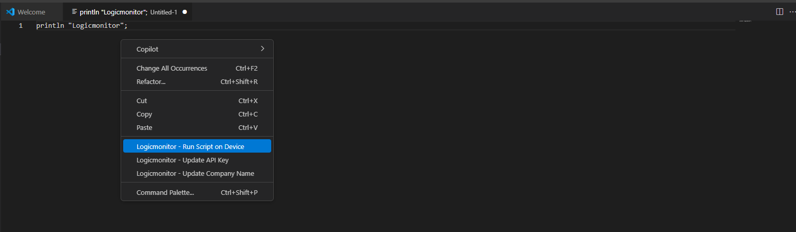
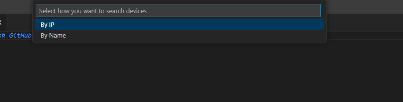
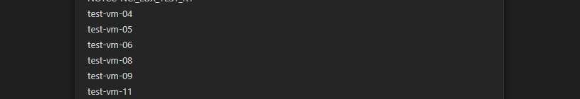
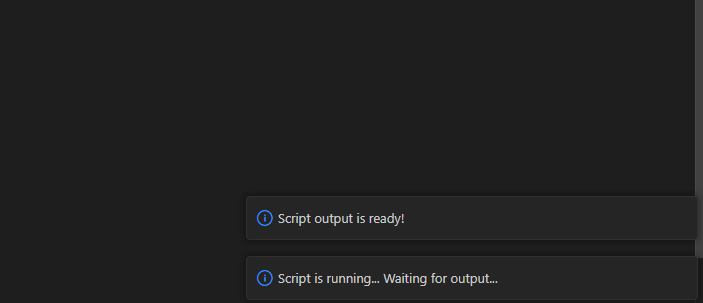
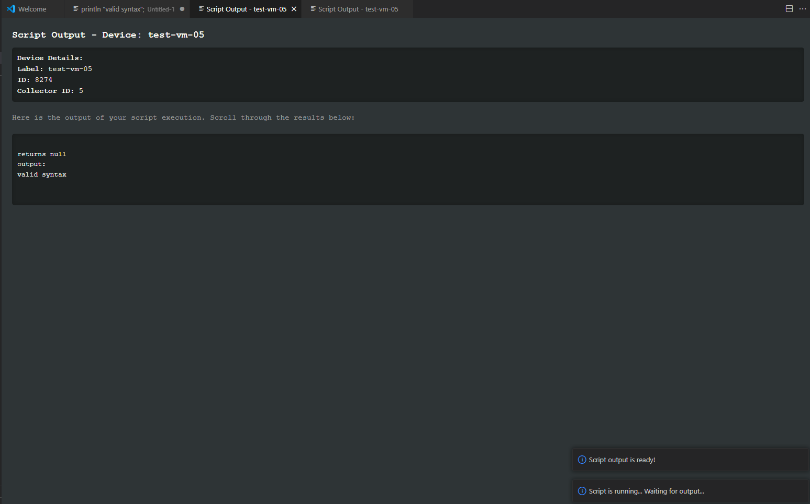
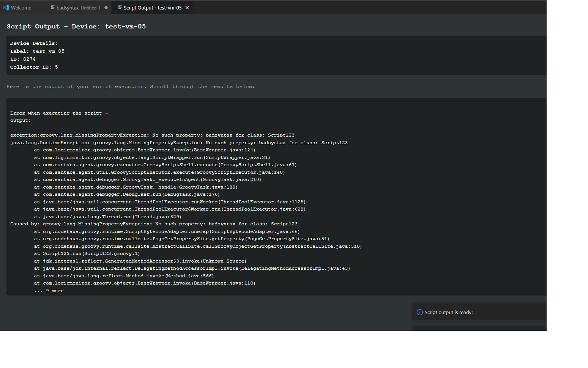

# logicmonitor-groovy-runner README

> ⚠️ This is my 1st time making a VSCode extension so any contributions would be welcome, I still need to complete the tests for this and publish to the exchange, I will likely chip away at this as and when I get time. Any feedback is appreciated !!!!

Run Groovy scripts against a specific device on Logicmonitor using VS Code allowing development in your IDE.
This means that you can use any syntax highlighting or any other extension in your IDE.

The idea behind this extension is so you don't have to copy and paste your code constantly into the Logicmonitor debug window for a collector.

It also means you don't have to keep selecting the device to run against each time.

Device can be selected by name or IP, both are contains operators for the filter.
API Key and company name required to use.

## Features

- Run Script against Device
- Select device by [ip, name]
- returns script output in console like webview window
- right click menu options aswell as commands pallete
- Collector ID is taken from the selected device

### Demo
Quick demo of running a simple groovy script against a device and shows how the output looks etc.

## Settings
The following settings are available:

- apiVersion: should be version 3 but can be changed e.g. for future compatibility
- apiProtocol: should always be https really but here as option
- apiDomain: should be logicmonitor.com but here as option
- apiPath: should be 'santaba/rest' but here as option
- pollEvery: How often to poll for output in milliseconds in case of long running scripts
- clearDeviceOnRestart: clear selected device on extension restart
- clearApiKeyOnRestart: clear API key on extension restart
- sizeValue: value for size parameter in API calls (GET Requests)

### Menu commands
Menu commands on right click in document

### Selecting a device
Select a device to run the script again.
Selected device is stored and script will run against this device and the collector the device is on.

#### Search command
Search for a device by IP or name.
> Note: Both use contains operator

Results are then shown 

Select the device when running the script the script will run on this device.

### Running a script
When you run the script it will poll for the output

### Outputs
Outputs will be shown in a textual manner on a new document

#### Good Output
For a sucesfull script output and return values shown as per LM Console

#### Bad Output
For a bad output error messages are shown / Traceback etc.

## Known Issues

- Only works with LM Bearer tokens as the LMv1 logic is quite cumbersome and most people should use Bearer tokens now anyway.
- if you select a device on collector 1 for example then it moves collector it will fail, in this case just re-select the device
- Likewise if you select a device and then it gets deleted or changed etc.

## Release Notes

...

### 1.0.0

Initial release of Logicmonitor Groovy Runner

